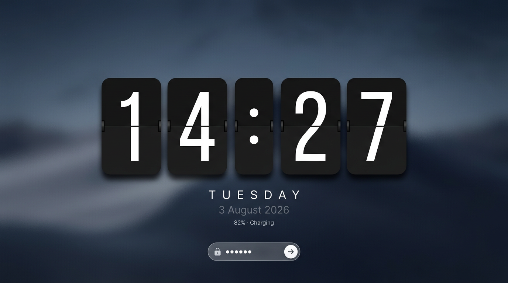

# PlasmaFlipLock

A complete custom lock screen for **KDE Plasma 6 / KScreenLocker** — minimal,
premium, Fliqlo-style. Full-screen blurred wallpaper, a huge mechanical flip
clock, date, battery status and a glassmorphism password panel.


*(design mockup — actual rendering is pixel-crisp QML)*

---

## Features

| Area | What you get |
|------|--------------|
| **Clock** | Retro split-flap clock, 24 h `HH:MM`, ≈ 45 % of screen height, digits ≈ 240 px at 1080p, black cards / white glyphs, rounded corners, soft shadows, seam (hinge) line. |
| **Animation** | True two-phase mechanical flip driven by a QML **`SequentialAnimation`** of two **`RotationAnimation`**s — runs **only when a digit actually changes** (≤ 3 cards per minute). |
| **Wallpaper** | Your configured lock-screen wallpaper, rendered by KDE's wallpaper plugin and blurred fullscreen on the GPU (greeter-side equivalent of compositor blur) + dim + vignette. |
| **Below the clock** | Day (`Tuesday`) and date (`3 August 2026`). |
| **Status strip** | Battery percentage + charging state (`82% · Charging`, vector battery icon with ⚡). Optional weather (opt-in setting). |
| **Password** | Frosted-glass panel at the bottom with integrated circular login button, delayed smooth fade-in, automatic keyboard focus, Enter-to-unlock, animated "wrong password" feedback, Caps-Lock warning. |
| **Auth** | **100 % KDE's own.** PAM / kcheckpass / fingerprint / smart-card logic is *untouched* — this is a pure UI layer on top of the greeter-provided `authenticator`. |
| **Multi-monitor** | One greeter view per screen, password text synchronized across screens (`PasswordSync` singleton, same mechanism as the stock lock screen). |
| **Performance** | GPU-accelerated, zero timers except the minute clock tick, static shadows/blurs rendered once. Designed for Intel HD Graphics 620. |
| **Responsive** | Proportion-based sizing: everything scales cleanly between 1366×768 and 1920×1080 (and beyond). |

---

## Target environment

- Fedora 44 (KDE spin)
- KDE Plasma 6.7 · Qt 6 · KDE Frameworks 6
- Wayland (also works on X11)
- Tested-by-design against the Plasma ≥ 6.4 greeter; a compatibility layer
  covers Plasma ≤ 6.3 (`authenticator.tryUnlock` era).

> ⚠️ **Fedora package updates note.** A system-mode install patches files
> inside the `plasma-desktop` package. When Fedora updates that package, the
> update may overwrite the lock screen with the stock one — simply re-run
> `install.sh` (your settings and old backups are safe). No lock screen or
> authentication breakage can result: the greeter always falls back to its
> built-in emergency UI (or the restored stock QML).

---

## Project structure

```
PlasmaFlipLock/
├── install.sh                # installer (system mode default, --user option)
├── uninstall.sh              # full rollback
├── backup.sh                 # standalone backup tool (auto-run by install.sh)
├── README.md
├── assets/
│   └── preview.png           # README preview mockup
└── contents/                 # = the lockscreen folder of a Plasma shell package
    ├── LockScreen.qml        # ENTRY POINT (greeter's "lockscreenmainscript")
    ├── LockScreenUi.qml      # composition root: bg, layout, AUTHENTICATION GLUE
    ├── FlipClock.qml         # HH:MM assembly + minute-aligned time source
    ├── FlipDigit.qml         # one flip card + SequentialAnimation flip logic
    ├── BatteryWidget.qml     # battery %/charging (+ optional weather) strip
    ├── PasswordPanel.qml     # glass field, login button, entrance + shake anims
    ├── Theme.qml             # ALL design tokens & feature settings (edit me)
    ├── PasswordSync.qml      # singleton: sync typed text across monitors
    ├── qmldir                # registers the PasswordSync singleton
    ├── metadata.json         # informational metadata for this contents folder
    ├── config/
    │   └── main.xml          # user settings schema ([Greeter][LnF] overrides)
    └── assets/
        ├── fonts/
        │   ├── BebasNeue-Regular.ttf   # bundled digit font (SIL OFL)
        │   └── OFL.txt
        └── icons/
            ├── arrow-right.svg         # login-button glyph (design source)
            └── lock.svg                # padlock glyph (design source)
```

---

## Install

Close anything important first — although nothing here restarts your session.

```bash
cd PlasmaFlipLock
chmod +x install.sh uninstall.sh backup.sh        # once

sudo ./install.sh
```

What `install.sh` does (system mode, default):

1. Detects the active Plasma shell package
   (`plasmashellrc [Shell] ShellPackage`, default `org.kde.plasma.desktop`
   at `/usr/share/plasma/shells/org.kde.plasma.desktop`).
2. Runs `backup.sh` → timestamped copy of the stock
   `contents/lockscreen/` to `~/.local/share/plasmafliplock/backups/<ts>/`.
3. Copies `contents/` over `contents/lockscreen/` (atomically, via a staging
   dir), normalises permissions, and writes an install manifest.
4. Prints test instructions. **Authentication files are never touched.**

### Alternative: rootless install

```bash
./install.sh --user
```

Copies the whole shell package to
`~/.local/share/plasma/shells/org.kde.plasma.desktop.fliplock`, replaces only
its `contents/lockscreen`, and points `plasmashellrc [Shell] ShellPackage` at
the copy. No root needed. The desktop shell adopts the copied package after
the next plasmashell restart — its contents are identical to stock except for
the lock screen, so the desktop looks and behaves the same. `uninstall.sh`
points the setting back and deletes the copy.

---

## Testing (do this BEFORE really locking)

```bash
kscreenlocker_greet --testing
```

- Opens the lock screen in a normal window — **your session is not locked**.
- Type your **real** password and press Enter: in testing mode the greeter
  authenticates for real and exits on success.
- Or just close the window / `Ctrl+C` in the terminal.
- To test a specific installed package (e.g. the `--user` copy):

```bash
kscreenlocker_greet --testing --shell org.kde.plasma.desktop.fliplock
```

Watch QML diagnostics if something looks off:

```bash
QT_LOGGING_RULES="kscreenlocker_greet.debug=true" kscreenlocker_greet --testing
# or live system log while locking for real (run before locking):
journalctl --user -f | grep -i screenlock
```

> 💡 In testing mode you can also first try the *stock* UI from the backup:
> `kscreenlocker_greet --testing` after temporarily setting
> `--shell <other-package>` is not needed — testing never modifies anything.

---

## Uninstall / rollback

```bash
sudo ./uninstall.sh        # restores the newest backup (system mode)
./uninstall.sh             # restores shell-package pointer (user mode)
```

Backups live in `~/.local/share/plasmafliplock/backups/`.
Make an extra safety copy any time with `./backup.sh`.

**If automatic restore fails** (e.g. backups deleted):

```bash
sudo dnf reinstall plasma-desktop        # restores the stock lock screen files
```

**If you are currently locked out behind a broken screen** (should not happen:
on QML load errors the greeter automatically shows its built-in fallback lock
screen — but just in case):

1. Switch to a text console: `Ctrl+Alt+F3`
2. Log in and run: `loginctl unlock-session`
3. Switch back to the graphical session and repair the files as above.

---

## Configuration

Everything visual lives in **`contents/Theme.qml`** — one file with every
color, size and timing, extensively commented. Persistent per-user overrides
(no file editing) are supported through `kscreenlockerrc` group
`[Greeter][LnF]` (schema: `contents/config/main.xml`):

```bash
# enable/disable pieces
kwriteconfig6 --file kscreenlockerrc --group Greeter --group LnF --key showBattery true
kwriteconfig6 --file kscreenlockerrc --group Greeter --group LnF --key blurWallpaper true
kwriteconfig6 --file kscreenlockerrc --group Greeter --group LnF --key clockScale 1.1

# weather (opt-in): needs a source in "provider|City" form
kwriteconfig6 --file kscreenlockerrc --group Greeter --group LnF --key showWeather true
kwriteconfig6 --file kscreenlockerrc --group Greeter --group LnF --key weatherSource "bbcukmet|London"
```

| Setting | Default | Meaning |
|---------|---------|---------|
| `showBattery` | `true` | battery % + charging state strip |
| `showWeather` | `false` | temperature in the status strip |
| `weatherSource` | `""` | weather engine source, `provider\|City` |
| `blurWallpaper` | `true` | fullscreen GPU blur of the wallpaper |
| `clockScale` | `1.0` | clock size multiplier (0.6–1.4) |

Weather note: modern Plasma removed the legacy *weather dataengine*; the
weather option therefore works **only where that engine is still shipped**
(mainly older Plasma / some distro packages). Failures are silent by design —
the lock screen never breaks because of it. (Default: disabled.)

### Wallpaper

The lock screen shows whatever wallpaper you configured in
**System Settings → Screen Locking → Appearance → Wallpaper type/Picture**.
It's blurred and dimmed by PlasmaFlipLock (set `blurWallpaper=false` to keep
it sharp).

---

## Customization quick reference

| Want | Where |
|------|-------|
| Clock bigger/smaller | `Theme.clockHeightFactor` / `clockScale` or the config key |
| Thicker digits | swap the bundled font or raise `Theme.digitScale` |
| Different card color | `Theme.cardColorTop/Mid/Bottom` |
| Different flip speed/feel | `Theme.flipDuration` + easings in `FlipDigit.qml` |
| Disable wallpaper blur | config key `blurWallpaper` or `Theme.blurWallpaper` |
| Panel height/radius/glass strength | `Theme.panelHeightPx`, `panelRadiusFactor`, `glassOpacity` |
| Use another digit font | drop a TTF/OTF into `contents/assets/fonts/` and point `FontLoader`/`Theme.digitFontFamily` at it (FontLoader in `LockScreenUi.qml`) |

---

## How it hooks into KScreenLocker (architecture)

Plasma 6's greeter (`kscreenlocker_greet`) loads the lock screen QML from the
active **Plasma shell package** through the KPackage definition
`lockscreenmainscript → contents/lockscreen/LockScreen.qml`
(see `libplasma …/shell/shellpackage.cpp` and
`kscreenlocker …/greeter/greeterapp.cpp`). It then:

- parents the configured **wallpaper** item to our root (we blur it),
- provides context properties: `authenticator`, `wallpaper`, `config`,
  `kscreenlocker_userName`, `kscreenlocker_userImage`,
- writes `viewVisible` / `locked` on our root item,
- **exits and unlocks** when our QML calls `Qt.quit()` after the
  `authenticator` emitted `succeeded()`.

PlasmaFlipLock implements exactly this contract and nothing more. There is:
**no PAM code, no kcheckpass changes, no auth config changes** — the KDE
authentication backend is fully preserved.

If our QML fails to load, the greeter prints the errors and automatically
loads its built-in fallback lock screen, so you can always log back in.

## Performance notes

- Blur & shadows run through `MultiEffect` (Qt RHI shaders, GPU) and are
  **static** — rendered once, not per frame.
- Idle cost ≈ one QML timer per **minute** (KDE clock service) + zero
  repaints (nothing animates while idle).
- During a flip (≤ 560 ms/min) only two card halves are transformed.
- Software rendering (`llvmpipe`) is detected and fullscreen blur is skipped
  automatically.
- `NativeRendering` text: giant glyphs are rasterized once and cached as
  textures; the flip moves GPU geometry, not glyph rasterization.

## Compatibility

| Component | Expectation |
|-----------|-------------|
| Plasma 6.7 (target) | ✅ designed for it (shell-package lockscreen + PamAuthenticators API) |
| Plasma 6.4 – 6.6 | ✅ same greeter contract; `pamTimeout` handled when present |
| Plasma 6.0 – 6.3 | ✅ QML is compatible (guarded `tryUnlock` path etc.). Note: those releases load the screen from `…/plasma/look-and-feel/<id>/contents/lockscreen/` instead of the shell package — copy `contents/` there manually instead of using `install.sh`. |
| QtQuick.Effects (Qt ≥ 6.5) | required (part of qt6-qtdeclarative on Fedora) |
| BatteryControlModel / keyboardindicator | ship with plasma-workspace (same modules the stock lock screen uses) |

## Credits & licenses

- PlasmaFlipLock QML + scripts: GPL-2.0-or-later.
- Digit font **Bebas Neue** — © 2010 Dharma Type, SIL Open Font License 1.1
  (`contents/assets/fonts/OFL.txt`), bundled unmodified.
- Inspired by the classic *Fliqlo* split-flap clock. Not affiliated.
